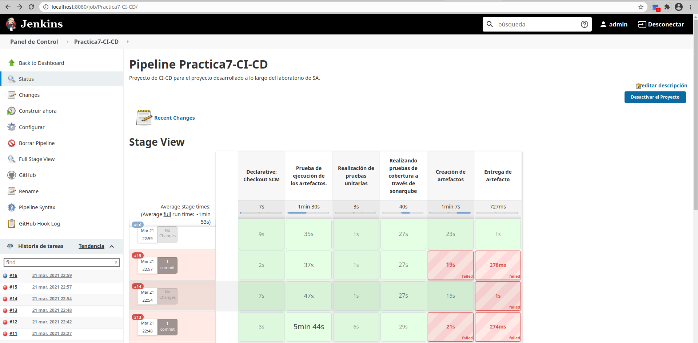
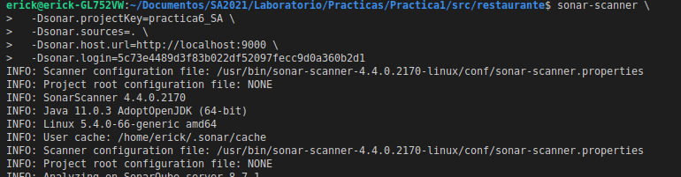
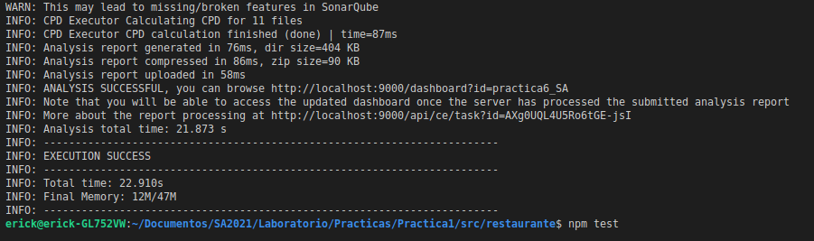
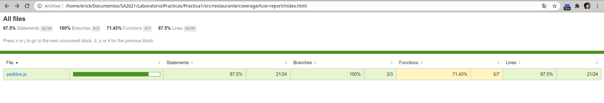
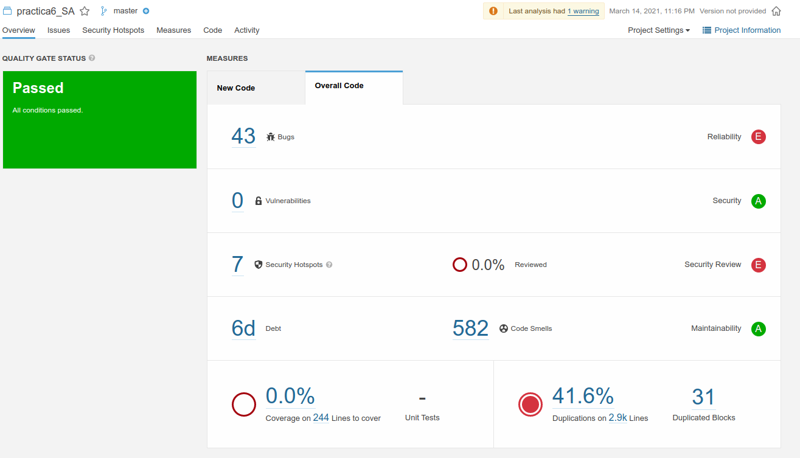
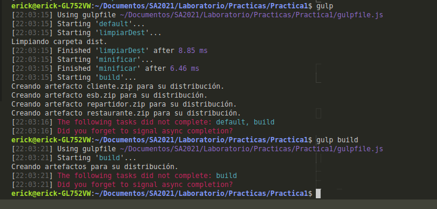
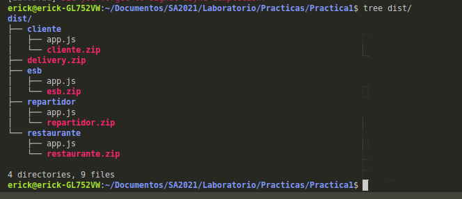
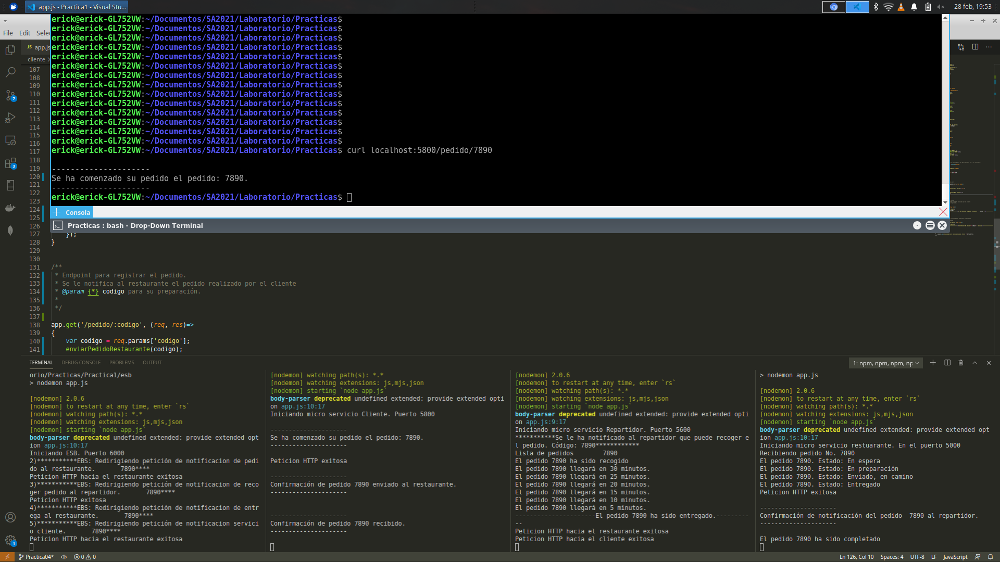

# Laboratorio Software Avanzado
## Práctica 7

En esta práctica se ha tomado como base el proyecto de la práctica 6 y ahora implementar el ciclo CI/CD utilizando la metodología DevOps. 

## Servidor de integración continua : Jenkins

Se ha instalado y configurado localmente un servidor de integración Jenkins con los siguientes stages:

- Prueba de ejecución: Se prueba que los micro servicios se ejecuten correctamente.
- Pruebas unitarias: Se lanzan pruebas unitarias.
- Pruebas de cobertura: Se lanza el análisis de las pruebas usando sonar-scanner.
- Creación artefactos: Se crean los artefactos utilizando gulp.
- Entrega artefacto: Se copia el artefacto al directorio de entrega. 




## Logs de ejecución correcta de pipeline [logsJenkins.txt](./logsjenkins.txt)
## [Click para ir al directorio hacia releases de artefactos](https://github.com/ErickTejaxun/SA-Practicas/releases)


Con base en la práctica número 5 se ha agregado soporte para lanzamiento de pruebas y reporte de coberturas. 

## Pruebas de cobertura.
Se ha utilizado mocha framework para poder lanzar las diferentes pruebas de funcionamiento. 

Fragmento de [archivo de prueba](./src/restaurante/test/test.js)
```js
    it('Verificando el estado inicial del nuevo pedido <<En espera>>',(done)=>
    {
        tmpPedido.status.should.equal('En espera');
        done();
    });
```    


## Reporte de cobertura
Para poder medir la cobertura de código se ha utilizado sonarqube para poder analizar las diferentes partes del código. Para ello se utilizó el siguiente archivo de configuración. 

```
 
# required metdata
sonar.projectKey=practica6_SA
sonar.projectVersion=1.0
sonar.sourceEncoding=UTF-8
# sonar.language=js
sonar.eslint.eslintconfigpath=eslintrc.json

# path to srouce directories
sonar.sources=.
# sonar.tests=app/test/integration/api/

# excludes
sonar.exclusions=node_modules/*,coverage/lcov-report/*

# coverage reporting
sonar.javascript.lcov.reportPaths=coverage/lcov.info
# sonar.surefire.reportPaths=app/coverage/lcov-report

-Dsonar.host.url=http://localhost:9000
-Dsonar.login=5c73e4489d3f83b022df52097fecc9d0a360b2d1
```




## Video de demostración
El video de demostración se puede seguir en el siguiente (enlace)[https://youtu.be/ONfTqaQgvOE]

## Resultados
Se han obtenido los siguientes resultados de la cobertura del código de la clase [pedidos](./src/restaurante/utils/pedidos.js)





## Automatización de construcción de artefactos
Para la creación de artefactos se ha utilizado gulp para poder automatizar el proceso. 

Las tareas que se han desarrollado son las siguientes:
- build : Esta tarea tiene como objetivo construir el artefacto. Es la tarea por defecto
- limpiarDest: Limpia la carpeta dist para la creación de la nueva versión del artefacto.
- minificar: Comprime los scripts js que componen cada uno de los servicios.

El código completo se encuenta en el archivo [gulpfile.js](./gulpfile.js)


```js
exports.build2 = build;
exports.build= buildSystem;
exports.minificar = minificar;
exports.limpiar = limpiarDest;
exports.copiarModules = copiarModules;
exports.default = series(limpiarDest, minificar, build, buildSystem);
```

### Artefactos 
Los artefactos que se generan para la entrega son los siguientes:
- clientes.zip : Archivo comprimido con el código fuente del microservicio clientes. 
- esb.zip : Archivo comprimido con el código fuente del esb.
- repartidor.zip: Archivo comprimido con el código del microservicio repartidor.
- restaurante.zip: Archivo comprimido con el código del microservicio restaurante. 
- delivery.zip: Archivo comprimido con los artefactos anteriores. 

Los artefactos son almacenados en la carpeta dist. 





### Microservicios 

Los tres micro servicios y el ESB han sido desarrollados a través de:

- Nodejs v14.15.1
- Express Framework 4.16.1

Ya que todos los micro servicios están siendo ejecutados en el mismo servidor, se utilizarán los siguientes puertos:
- Cliente: Puerto 5800
- Restaurante: Puerto 5000
- Repartidor: Puerto 5500
- ESB: Puerto 6000


## [ESB](.src/esb)
Este micro servicio funge como ESB el cual es el encargado de orquestar los diferentes servicios entre sí. 

Para instalar las librerias necesarias:
```bash
npm install package.json
```
Para ejecutar 

```bash
npm start
```

## [Micro servicio Cliente](.src/cliente)
Este micro servicio sirve como interfaz para el usuario. 

Para instalar las librerías necesarias:
```bash
npm install package.json
```

Para ejecutar 

```bash
npm start
```


## [Micro servicio Restaurante](.src/restaurante)
Este microservicio representa a un restaurante que recibe y prepara el pedido del cliente. 

Para instalar las librerías necesarias:
```bash
npm install package.json
```

Para ejecutar 

```bash
npm start
```

## [Micro servicio Repartidor](.src/repartidor)
Este microservicio representa al repartidor que está encargado de transportar el pedido y a través de este servicio el cliente puede saber el estado de su pedido. 

Para instalar las librerías necesarias:
```bash
npm install package.json
```

Para ejecutar 

```bash
npm start
```

## Demostración del sistema
La demostración del funcionamiento del sistema se puede ver en el siguiente enlace
[Enlace al video](https://youtu.be/4r07jutYQ3w)

Y aquí se puede observar una captura de pantalla del resultado del sistema luego de realizar un pedido. 



# Autor
  Erick Tejaxún

  erickteja@gmail.com

  201213050
