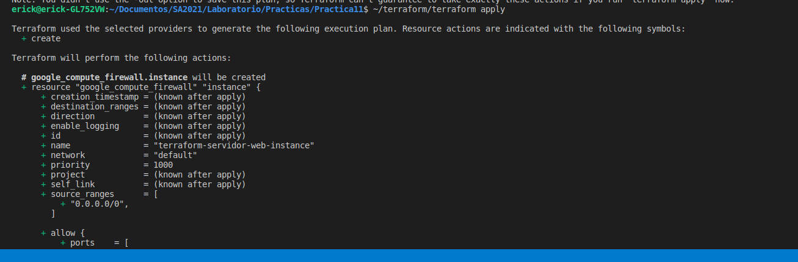
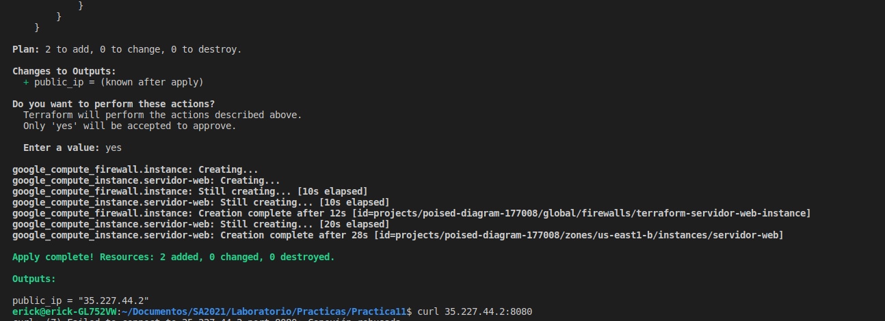
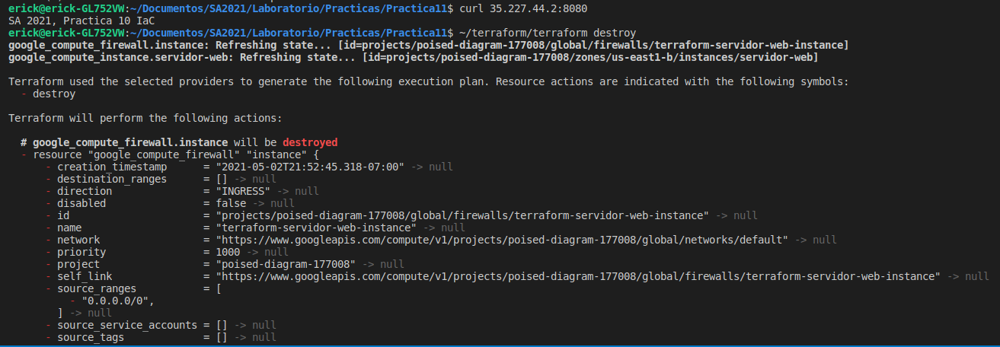
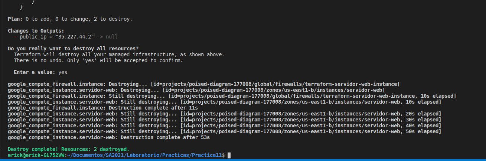

# Laboratorio Software Avanzado
## Práctica 12

Esta práctica tiene como objetivo mostrar la utilización de Terraform 
para la implementación de la práctica de Infraestructura como código. 

Basandonos en la práctica número 11, vamos a utilizar terraform para clonar 
la infraestructura de un despliegue para poder replicarlo.

terraform import google_compute_instance.default projects/poised-diagram-177008/zones/us-east1-b/instances/servidor-web
terraform show -no-color > nuevo/main.tf

https://youtu.be/kA4jhUy7yNE

### Despliegue de la intraestructura

### Destrucción de la infraestructura

